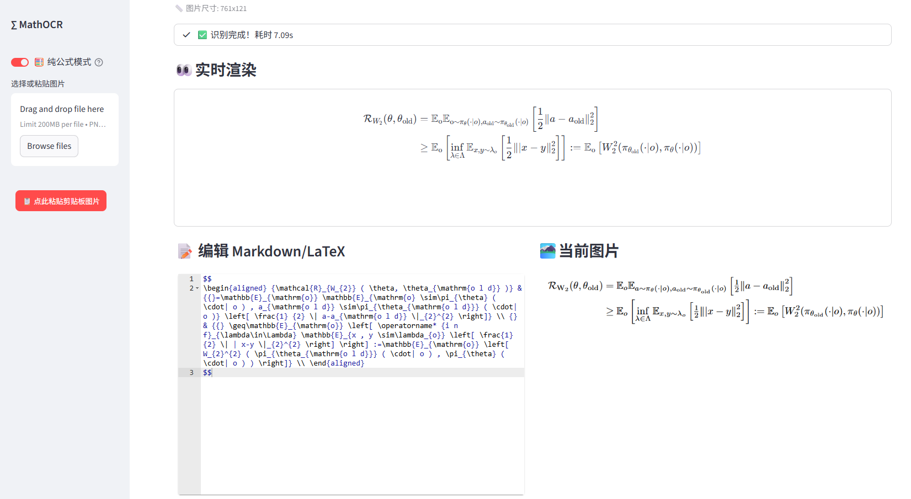

# Math OCR

GUI base on Streamlit and Pix2Text, supporting pasting images directly (button `📋 点此粘贴剪贴板图片`).

Usage:

```
pip install -r requirements.txt

streamlit run ocr.py --server.port=8500
```




Code generated by gemini-3-pro-preview

MIT License